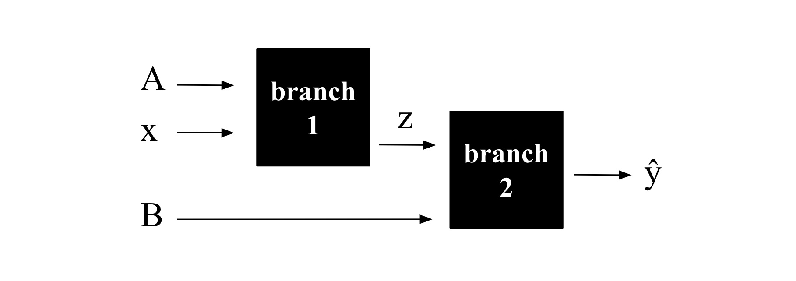
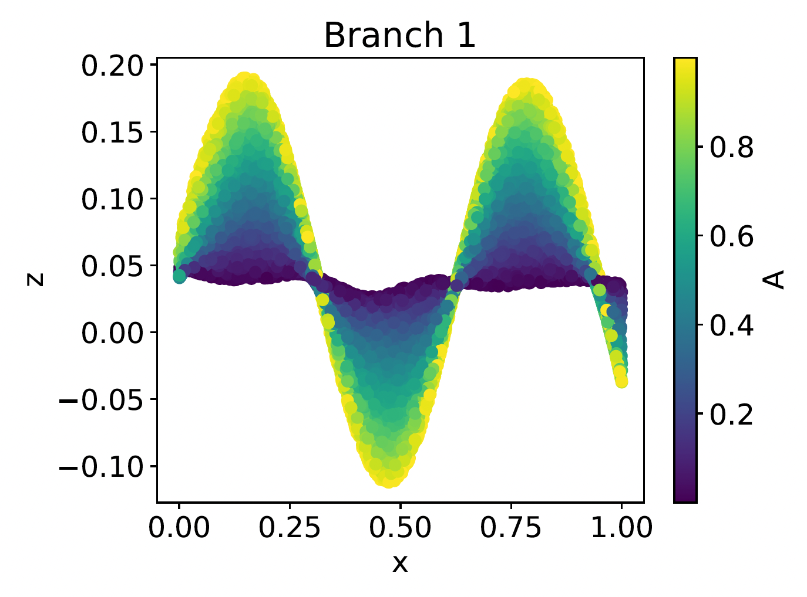

# Branch_Model
The Branch Model is an interpretable machine learning model. This means that it can transparently reveal what it has learned about the relationship between the input parameters and the output parameter. The example in this repository demonstrates the methodology.

# Scenario
Assume that we have a variable of interest y, and we want to investigate how it depends on three input parameters A, x and B. Here, the true underlying function is:

y = Asin(10x) + B

which we used to generate the database, where A, x and B are randomly sampled from a uniform distribution between 0 and 1. In a real scenario, we would of course not be aware of the true underlying function, but we include it here such that we can compare with the results of the Branch Model.

# Step 1 

In the first script: 01_benchmark_nn.py, we build a regular dense neural network that predicts y from A, x and B. Since a regular neural network is a black box, we cannot determine how y depends on the three inputs yet. This step is just about obtaining a benchmark prediction error that we can compare with the Branch Model later.

# Step 2 

In the second script: 02_finding_branch_model_architecture.py, we begin playing around with Branch Models. For three input parameters, the Branch Model architecture looks like:

The idea here is that the network is split into branches with a maximum of two inputs each. This enables interpretability as the output of each branch can be plotted versus its two inputs, which is demonstrated in step 3. However, before that, we need to figure out which of the inputs should go into the different branches. This is the main task of step 2, and is done by training Branch Models and evaluating the error of each possible setup. As can be seen in the image below, parsing A and x through branch 1 results in the lowest error, meaning that it is the appropriate choice of parameters to be parsed through branch 1. This is expected since the first term in the true underlying equation needs to be calculated before it can be summarized with B.

# Step 3

Now that we know from step 2 that A and x should go into branch 1, we can build the final Branch Model architecture:

In the final script: 03_final_branch_model.py, this architecture is trained, and then we plot the mapping of the two branches to transparently reveal the relationship between the output y and the three inputs A, x and B.

    
    

Note that in order to grasp the relationship between y and the inputs A and x, we need to analyze the intermediate parameter z. In total, we observe a sine-like dependency between x and z (which is proportional to y), where A determines the amplitude of the sine wave. We also see that B is linearly correlated with y, where the contribution from B appears to be summed with the contribution from z (x and A). In other words, through the visualizations, we have obtained a global overview of the parameter relationships. In this case, the Branch Model is successful in overall mirroring the true underlying function.

# Remarks

The current state of the Branch Model methodology is suitable for cases with relatively few input parameters (< 10) as the complexity increases with the number of inputs. We also want to acknowledge that the idea of visualizing neural network mappings is inspired by Neural Additive Models (NAMs).

Note about running the codes: Occasionally, the weights can get stuck in local optima during training, which may lead to a higher error than expected. If this happens, just rerun the code. Alternatively, consider adjusting the code so that each Branch Model setup is trained several times, and select the minimum error for the evaluation of the setup to bypass the occasional high error instances.
